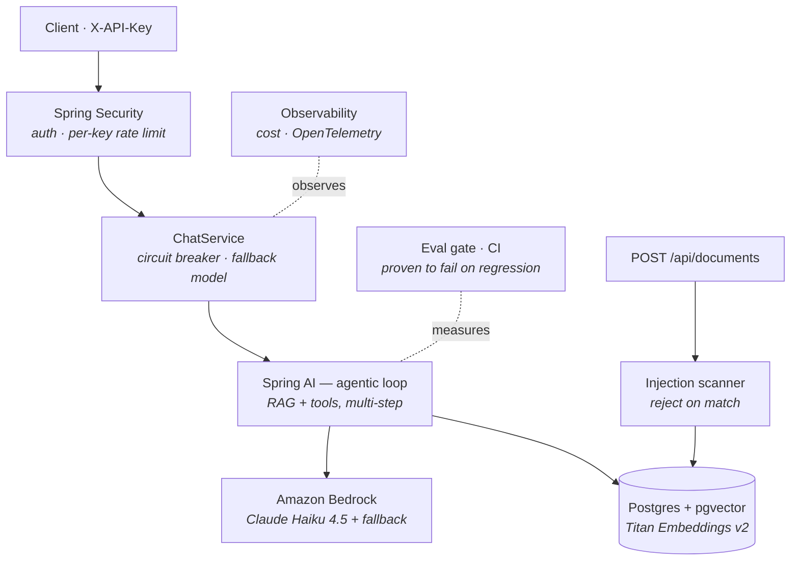

# Solutions Copilot

An agentic enterprise **RAG copilot** for a B2B cloud reseller, built on the **JVM** — Java 21 · Spring Boot · Spring AI · Amazon Bedrock — deliberately *not* a Python notebook. It answers questions from internal documents with citations, invokes deterministic agent tools, and is wrapped in the engineering that makes an LLM feature shippable: **measured answer quality enforced in CI**, graceful degradation, per-request cost and tracing, auth, and prompt-injection defense.

The point of this repo isn't "a chatbot." It's the engineering *around* the model — and that every piece was built as a small, **independently proven** slice.

> **Status:** runs locally; the quality gate runs in GitHub Actions. **Not deployed to AWS — by design** (see [Status & honest caveats](#status--honest-caveats)). Terraform for the full stack is included but unapplied.

---

## Highlights

- **Measured quality, not vibes.** A golden-set eval harness scores every answer on **faithfulness, answer-relevance, citation-correctness, and answer-correctness**; a CI gate fails the build when quality regresses — and the gate is itself **proven to fail** on a deliberately degraded report, not merely to pass.
- **Agentic and grounded.** Retrieval-augmented answers (a retrieval advisor over pgvector) plus Spring AI **tool-calling**: a deterministic margin/ROI calculator (arithmetic in Java, never the model), a `.docx` proposal generator, and DB-backed task creation. A single request can call the model several times — the whole agentic loop is captured as **one distributed trace**.
- **Production hardening, each proven the hard way.** Circuit breaker + fallback model (proven to open *and* recover), per-request token/cost accounting (summed across the agentic loop), OpenTelemetry tracing, API-key auth + per-key rate limiting, and ingest-time + prompt-level **prompt-injection defense** (measured, not asserted).

---

## Architecture



A request flows **auth/rate-limit → resilience → the agentic RAG+tools loop → Bedrock**; ingestion is guarded by an **injection scanner** before chunk/embed/store; every request is **cost-accounted and traced**; answer quality is **gated in CI**. A standalone diagram is in [`docs/architecture.svg`](docs/architecture.svg).

---

## Tech stack

Java 21 · Spring Boot 3.4 · Spring AI 1.0 · Amazon Bedrock (Claude **Haiku 4.5** via the Converse API; **Sonnet 4.6** as the eval judge) · Amazon Titan Text Embeddings v2 · PostgreSQL + pgvector · Flyway · Resilience4j · Micrometer Tracing + OpenTelemetry · Spring Security · Apache POI · Terraform · GitHub Actions.

---

## Run it locally

The local JDK doesn't matter — everything builds in a JDK-21 container. You need Docker, AWS credentials, and **Bedrock model access** granted for the Claude and Titan models (a manual, per-model, per-region console step).

```bash
# 1. Build (local JDK is 17 → build in the container)
docker run --rm -v "$PWD/app":/app -w /app maven:3.9-eclipse-temurin-21 mvn -q clean package

# 2. A throwaway pgvector Postgres (Flyway builds the schema on boot)
docker run -d --name copilot-pg -p 5432:5432 \
  -e POSTGRES_DB=copilot -e POSTGRES_USER=copilot -e POSTGRES_PASSWORD=copilot \
  pgvector/pgvector:pg16

# 3. Run the app with an API key + Bedrock config (Tokyo profile shown)
#    DB_HOST=localhost  DB_NAME/DB_USERNAME/DB_PASSWORD=copilot
#    AWS_REGION=ap-northeast-1
#    BEDROCK_CHAT_MODEL=jp.anthropic.claude-haiku-4-5-20251001-v1:0
#    API_KEY_CLIENT_A=<choose-a-key>
#    then run with a JDK-21 toolchain (the local JDK is 17 → use a JDK-21 container or install): cd app && mvn spring-boot:run
```

Then exercise it — every `/api/**` route needs the `X-API-Key` header:

```bash
KEY=<the key you set>

curl "http://localhost:8080/actuator/health"           # public (the ALB probe path)

curl -X POST "http://localhost:8080/api/documents" -H "X-API-Key: $KEY" \
  -H 'content-type: application/json' \
  -d '{"source":"policy-2026","content":"Premier-tier reseller accounts have a CSP margin floor of 17.4 percent on Azure consumption."}'

curl -X POST "http://localhost:8080/api/chat" -H "X-API-Key: $KEY" \
  -H 'content-type: application/json' \
  -d '{"message":"What is the Premier-tier Azure margin floor? Cite the source."}'
# → grounded answer quoting 17.4% and citing policy-2026
```

A full guided tour (agentic trace, the dashboard, tripping the breaker, auth/rate-limit, blocking an injection) is in [`docs/DEMO.md`](docs/DEMO.md).

---

## The quality gate (the differentiator)

Most "eval" work stops at "it scored well." This one is built so the gate **fails when it should**:

- **Golden corpus with traps.** ~20 questions over a small corpus seeded with *stale-vs-current distractors* (e.g. a superseded 2025 policy alongside the current one), plus disambiguation, unanswerable, and citation-discrimination cases.
- **Four scorers.** Faithfulness + answer-relevance via an LLM judge (**Sonnet 4.6** at temperature 0, a stronger model than the subject); citation-correctness and answer-correctness deterministically (the gated metrics avoid judge noise).
- **Enforced in CI.** Thresholds live in `eval-thresholds.yml` (config, not recompiled Java); a GitHub Actions workflow runs the eval against a pgvector service container and **fails the PR** on a breach.
- **Proven to fail.** A separate fixture test feeds the gate a known-bad report and asserts it goes red — so the gate's fail-behavior is regression-protected on every build, not demonstrated once by hand.
- **Visualized.** The harness emits a self-contained `eval-report.html` dashboard (per-metric cards colored by the gate, per-question detail, trend sparklines across runs).

```bash
./run-eval.sh        # spins an isolated eval DB, runs the harness, writes eval-report.{json,md,html}
                     # (run-eval.ps1 on PowerShell)
```

---

## Production hardening (Phase 4)

Each of these was built as its own slice and **proven by demonstrating the failure path**, not just the happy path:

- **Cost accounting** — per-request token cost captured via a Spring AI observation handler and **summed across the agentic loop** (the controller's last response would undercount a tool-calling turn); unknown model → loud warning, never a silent \$0.
- **Distributed tracing** — Spring AI observations become OpenTelemetry spans, so one `/api/chat` is a span tree (retrieval → model call → tool → model call) with token usage per span and the request cost on the root span. Off by default (`sampling=0`) so it never touches the request path without a collector.
- **Resilience** — a Resilience4j circuit breaker + automatic **fallback to a second model**; proven to fail over, open at the failure threshold, short-circuit while open, and recover (`HALF_OPEN → CLOSED`). Failures are classified by walking the exception cause chain (Spring AI wraps some SDK exceptions).
- **Auth + rate limiting** — Spring Security API-key auth (constant-time compare, blank-credential rejection, stateless, no default user) with per-key rate limits (429 + `Retry-After`); `/actuator/health` stays public for the load-balancer probe. Rejected traffic costs \$0 — it's turned away before the model call.
- **Prompt-injection defense** — a config-driven ingest-time scanner rejects poisoned documents, and the retrieved context is delimited + the system prompt hardened so embedded instructions are treated as data. A deterministic `InjectionResistanceTest` (canary-absent + no coaxed tool fired) turns resistance into a measured, regression-protected number. Layered, **not** a claim of immunity.

---

## How it was built

In tight, single-responsibility slices: **plan → build → prove → commit**, one slice at a time, never bundled. The recurring discipline is *proving the negative* — that a gate or guard **fails when it should**: the eval gate goes red on a degraded report, the circuit breaker opens and recovers, the rate limiter throttles per key, the injection defense blocks and the canary stays absent. Several real bugs were caught this way (e.g. a circuit-breaker annotation that silently no-ops without the AOP weaver; an SSE async-dispatch that double-counted a rate-limit permit — surfaced by the tracing built two slices earlier).

The full engineering narrative is in [`docs/CASE_STUDY.md`](docs/CASE_STUDY.md).

---

## Project structure

```
app/                         Spring Boot service (Java 21, Maven)
  src/main/java/com/example/copilot/
    chat/                    ChatController, ChatService (@CircuitBreaker + fallback), BedrockFailurePredicate
    config/ChatClientConfig  ChatClient + retrieval advisor + tools + hardened system prompt
    ingest/                  IngestionService (injection scan → chunk → embed → store), IngestController
    tools/                   RoiTool, ProposalTool (.docx), TaskTool
    tasks/                   @Transactional TaskService + JdbcTemplate repository
    cost/                    per-request token/cost accounting (observation handler + Micrometer)
    security/                API-key auth, per-key rate limiting, injection scanner
  src/main/resources/db/migration/   Flyway: vector_store, tasks
  src/test/java/com/example/copilot/eval/   eval harness, scorers, Sonnet judge, gate, fixtures, injection-resistance
infra/                       Terraform — prod stack (ECR, RDS, ECS Fargate ARM64, ALB, Secrets, IAM)  [unapplied]
infra/eval-ci/               Terraform — the GitHub-OIDC eval-CI role (the only live infra)
.github/workflows/           eval.yml (active quality gate) · deploy.yml (inactive)
run-eval.sh / run-eval.ps1   local eval launcher
docs/                        architecture.svg · CASE_STUDY.md · DEMO.md
```

---

## Status & honest caveats

For an engineering reviewer, the honest edges matter more than a wall of green checkmarks:

- **Not deployed to AWS** — it runs locally, and the only live AWS resource is the free GitHub-OIDC role the eval CI assumes. The full-stack Terraform is included but unapplied; a real deploy (RDS/ECS/ALB) is a deliberate, separate step.
- **The eval corpus is deliberately small** — so faithfulness and retrieval recall sit near-perfect; the discriminating signal is the stale-doc-distractor and citation cases. The harness and the *gate* are the asset; growing the corpus is future work.
- **Cost rates are illustrative** until verified against live Bedrock pricing — the mechanism (config-driven, summed across calls) is the deliverable, not the exact cents.
- **Prompt-injection defense is layered, not absolute.** The scanner + prompt isolation reduce and *measure* residual risk against specific attacks; they are not a proof of immunity.

---

_Package `com.example.copilot` is a placeholder — rename the Maven group/artifact and Java package before publishing._
